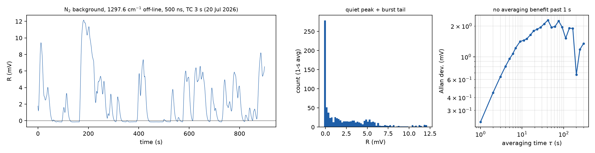
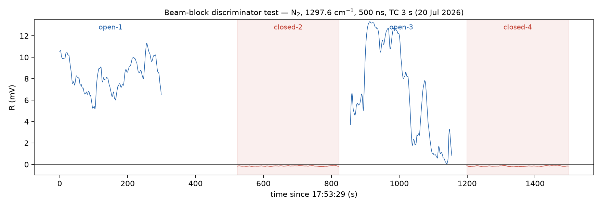
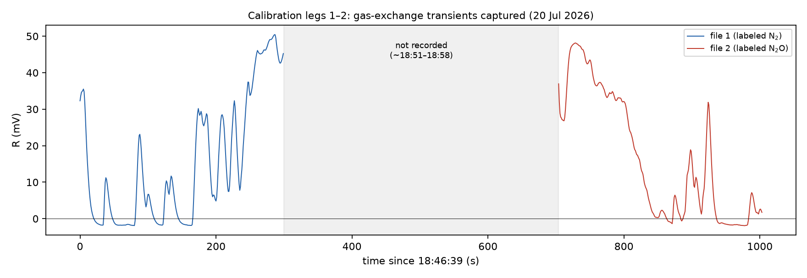

# Deney 1 — N₂ background recording (20 Jul 2026, 17:20–17:35)

**File:** `qepas_20260720_172044_N2_1297.6cm1.csv` (first DAQ recording of the
campaign). Conditions: pure N₂, 600 Torr, laser parked **off-line at
1297.6 cm⁻¹**, 500 ns, 3.21 mW, f_trig = 12458.8 Hz, TC 3 s, sens 20 mV,
R–θ mode, 10 Hz logging (1 MHz burst mean per point), 900 s. No DAQ clipping.
(Logger metadata says laser power "3.21 W" — unit label bug, value is mW.)

## Results

| Quantity | Value |
|---|---|
| Quiet-level background (48% of record, R < 1 mV) | **0.08 ± 0.31 mV** |
| Median over full record | 1.20 mV |
| σ (3-s averages, full record) | 2.94 mV |
| Short-term noise floor (Allan @ τ = 1 s) | 0.23 mV |
| Allan deviation | rises monotonically for τ > 1 s (1.35 mV @ 300 s) — no averaging benefit |
| Burst state (R > 3 mV) | 34% of record; irregular 30–90 s episodes reaching 3–11 mV |

## Interpretation

1. **The structural background has collapsed.** On 6 July the pure-N₂
   background at the same settings (500 ns, ~3.2 mW) read ~44 mV; today the
   quiet-level background is ≈ 0.1 mV — at the electronic floor. The 6-July
   "background ∝ P (R² = 0.989)" was therefore almost certainly
   alignment-induced clipping, largely removed by the 19-July realignment.
   The window-absorption contribution at 3.2 mW is below ~0.3 mV.
   *(Caveat: confirm the beam was through the ADM for the whole record —
   a 1-min laser-blocked segment in the next recording settles it.)*
2. **The noise budget is now dominated by episodic bursts,** not by a
   continuous background: irregular 3–11 mV excursions lasting 30–90 s,
   present off-line in pure N₂ → the cause is **not spectral and not the
   analyte**. Candidates: gas-system acoustics (pressure-controller valve
   action, pump pulsation coupling through tubing), structure-borne
   vibration, or episodic beam-pointing drift re-clipping a prong.
3. The earlier on-line "12–45 mV wander" is consistent with these same
   bursts adding (as phasors) to a steady ~35–40 mV gas signal.
4. **LOD implication:** with the burst noise untreated, σ(3 s) ≈ 2.9 mV
   limits the LOD; in the quiet state σ ≈ 0.3 mV — a ~10× difference.
   Identifying and suppressing the burst source is now the single
   highest-leverage improvement for the Photonics West numbers.

## Discriminator tests (next lab slots, ~15 min total)

- **Beam-block test:** record 5 min beam on → 5 min beam blocked → 5 min on.
  Bursts persist with beam blocked ⇒ acoustic/vibration/electrical pickup.
  Bursts vanish ⇒ optical origin (pointing/clipping). Also verifies item 1.
- **Flow/valve test:** 5-min segments at different N₂ flows (5/10/20 sccm)
  and, if possible, with the pressure-controller loop momentarily static —
  correlates bursts with gas-system activity.

---

# Deney 2 — beam-block discriminator test (20 Jul 2026, 17:53–18:18)

**Files:** `qepas_20260720_175329/180212/180745/181328_...csv` — four 300 s
segments, A-B-A-B: laser **open-1 → blocked-2 → open-3 → blocked-4**.
Identical conditions to Deney 1 (N₂, 600 Torr, 1297.6 cm⁻¹ off-line, 500 ns,
3.21 mW, TC 3 s, sens 20 mV); the beam was physically blocked, laser and all
electronics running throughout.

## Results

| Segment | median R | σ(1 s) | max | fraction > 1 mV | burst episodes ≥ 5 s |
|---|---|---|---|---|---|
| open-1 | 8.21 mV | 1.43 | 11.3 | 100% | 1 (long) |
| **blocked-2** | **−0.150 mV** | **0.019** | −0.11 | **0%** | **0** |
| open-3 | 6.39 mV | 4.52 | 13.3 | 89% | 4 |
| **blocked-4** | **−0.155 mV** | **0.022** | −0.10 | **0%** | **0** |

## Conclusions

1. **The burst/wander noise is 100% optical in origin.** Ten total minutes
   of beam-blocked data show a dead-flat trace (σ = 0.02 mV, zero events)
   while both open segments fluctuate continuously. Acoustic pickup from
   the gas system, pump vibration, and electrical interference are all
   ruled out as significant contributors at the current noise level.
2. **True electronic floor: −0.15 mV offset, σ = 0.02 mV** — 15× better
   than the previously assumed ~0.1 mV. The small negative offset is a
   CH1/DAQ zero offset; subtract it in analysis.
3. **The optical background itself drifts on ~10-min timescales:** ~0 mV
   for most of Deney 1 (17:20–17:35), ~8 mV steady at 17:53, wandering
   0–13 mV at 18:07. Combined with (1), the picture is episodic
   **beam-pointing drift causing intermittent prong/structure clipping** —
   the beam wanders near a prong edge; µm-scale pointing changes convert
   to mV-scale photoacoustic background.
4. Practical consequences:
   - Short-term mitigation candidates: enclose/baffle the free-space beam
     path against air currents; check mount rigidity; allow thermal
     settling after any adjustment. A cardboard/foam draft shield is a
     10-minute experiment: repeat a 5-min open recording with the path
     covered and compare σ.
   - Proper fix is Period B (pilot-beam fine alignment centring the beam
     in the prong gap, away from the clipping edge).
   - For today's calibration: background must be treated as a slowly
     varying 0–13 mV nuisance — bracket each concentration plateau with
     the off-line reading, or subtract the N₂ baseline taken close in time.

---

# Calibration legs 1–2 (20 Jul 2026, 18:46–19:03) — accidental park & switch

**Files:** `qepas_20260720_184639_N2_...` (leg 1) and
`qepas_20260720_185823_N2O_...` (leg 2). Line centre 1296.7 cm⁻¹, 500 ns,
3.1 mW, **sensitivity now 200 mV** (logger r_v factor 0.2 verified correct;
200 mV is a 1-range, not in the ×5 artifact list).

## What the traces show

- Leg 1 (labeled N₂): flat baseline 2–5 mV for the first ~3 min ✓, then a
  smooth S-shaped **rise to ~47 mV** in the last ~2.5 min.
- Unrecorded gap 18:51–18:58.
- Leg 2 (labeled N₂O): starts ~40 mV and **decays smoothly to ~0 mV**
  (τ ≈ 1 min, complete in ~4 min), staying at 0–2 mV thereafter.

## Interpretation: recording windows are offset by one leg vs the gas

The N₂O flow was evidently opened ~2.5 min into leg 1 (the rise is a
textbook chamber-exchange curve, not the jagged episodic clipping bursts of
Deney 2); the actual 100-ppm plateau (~47 mV) fell in the unrecorded gap;
and the switch back to N₂ coincided with the start of the leg-2 recording,
which therefore captured the purge decay. The labels lag the gas by one
transition.

**Silver lining — this IS the park-and-switch demonstration:** the signal
follows the gas cleanly in both directions, 2–5 mV ↔ ~47 mV, with a chamber
exchange time of ~2.5–3 min (≈1 min time constant). Gas attribution of the
1296.7 cm⁻¹ signal is hereby confirmed with logged data. Bonus numbers:
100 ppm on-line signal ≈ 45–47 mV at 3.1 mW / 500 ns (net ≈ 43–45 mV),
consistent with the R = 45 spot reading earlier today.

**Protocol fix for remaining legs:** switch gas → watch the display until
the plateau (allow ≥ 4–5 min = 3 time constants) → *then* start the 300 s
recording → verify live against expectation (N₂O → ~45 mV, N₂ → 0–5 mV);
if the level disagrees, check the FlowVision MFC settings before recording.
Keep sensitivity fixed at 200 mV for the entire series. (Leg-1 notes field
still said "laser close-4" — stale copy from Deney 2; filenames govern.)

## Notes / deviations from protocol

- Recording taken at 1297.6 cm⁻¹ (off-line), not the located line centre
  1296.7. Spectrally irrelevant for pure N₂ (flat background), but the
  daily-reference convention is line centre — keep 1296.7 for future
  daily-reference entries, or record the off-line point as its own series.
- Small negative readings (min −0.18 mV) = output/DAQ offset; negligible.
