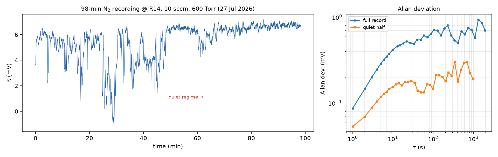

# 98-min N₂ stability recording (27 Jul 2026, 12:41–14:20)

**File:** `qepas_20260727_124141_N2_1296.7cm1.csv`. Pure N₂ (10 sccm,
flow-through since the 21-Jul valve fix), 600 Torr, R14 set point
(nominal 1296.7), 500 ns, 3.25 mW, TC 3 s, sens 200 mV, 10 Hz logging,
5895 s, no clipping.

⚠ **Metadata discrepancy to resolve:** header says
`Lock-in.mod_frequency = 12447.8 Hz` vs `Laser.rep_rate = 12458.8 Hz`.
An 11 Hz reference offset would demodulate essentially nothing (QTF FWHM
≈ 1.4 Hz), while the record shows a structured ~6 mV signal — so the
12447.8 entry is almost certainly a typo in the logger metadata, but it
must be confirmed and the field corrected. (The QTF f₀ spot check at
operating pressure is still pending regardless.)

## Results

| Quantity | Full record | Quiet regime (t > 2900 s) |
|---|---|---|
| Mean level | 5.51 mV | 6.42 mV |
| σ (1-s averages) | 1.44 mV | **0.42 mV** |
| Allan @ 1 s | 0.087 mV | **0.053 mV** |
| Allan @ 3 s | 0.200 mV | **0.088 mV** |
| Allan @ 10–100 s | 0.42 → … | **0.15 mV plateau** |

Slow drift +2.5 mV over the record (baseline rising — wall
desorption/optical drift, unresolved). A clear regime change at
~2900 s: before it, downward excursions (to ~0) and σ ≈ 1.5 mV; after
it, σ = 0.42 mV. Prime suspect: operator presence/room activity in the
first half (to be correlated with the lab log).

## Preliminary LOD projection (pending the calibration series)

With the provisional slope k ≈ 0.45 mV/ppm (45 mV / 100 ppm at ~3.2 mW,
from the 20-Jul trapped-charge level and the July-3 scan):

- 1σ @ 3 s: 0.088 mV → **≈ 0.20 ppm**
- 3σ @ 3 s: **≈ 0.6 ppm**
- drift-plateau limited (τ ≳ 10 s): 3σ ≈ 1 ppm

Sub-ppm 3σ LOD for a pulsed-EC-QCL 1f-AM N₂O QEPAS would be a strong
headline number. **These become quotable only after the calibration
series pins k** — the one dataset still missing.

## ⚠ Pressure caveat (added after operator correction, 27 Jul)

The `adm_pressure = 600 torr` metadata for the flow-through-period
recordings is **not verified**. With the ADM outlet open directly toward
the pump, the PCD (a dual-valve controller designed to regulate a
dead-ended process volume) cannot hold the chamber at 600 Torr — the
supply is MFC-limited while the pump drains through the open outlet, so
the chamber settles at a conductance-determined lower pressure. The
noise/Allan statistics of this recording stand, but its absolute
pressure (and hence signal-magnitude comparisons against 600 Torr data)
carries an unknown offset. Operating mode returns to the **closed
chamber** (outlet valve shut once), which the PCD is designed for:
gas exchange by evacuate–refill through the supply side.

## Notes

- The ~6 mV baseline at R14 in N₂ = residual N₂O tail + optical
  background (gap points read ~0–1 mV on 21 Jul; re-check today).
- Detection bandwidth bookkeeping: Δf = 1/(4·TC) or 1/(8·TC) per the
  slope setting — the slope is still not recorded in the logger
  metadata; add a `Lock-in.slope` field.
